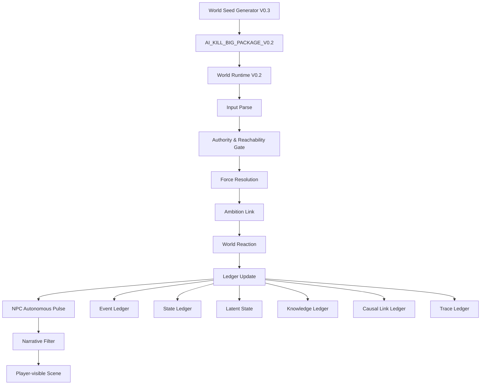

# AI殺很大！
## AI KILL BIG! — An AI-Native Emergent Story World Runtime

> **沒有劇本，世界自己演。**  
> **每個人都有野心。**  
> **玩家不是作者，世界也不等玩家。**

《AI殺很大！》是一套以大型語言模型（LLM）運行的**單人、多角色、無預寫未來敘事系統**。

它不是傳統劇本殺，也不是讓玩家與 AI 輪流接龍寫小說。

系統只先建立一個已經存在的世界：

- 固定的過去；
- 具有野心、秘密、誤判與資源的人物；
- 有限的空間與物品；
- 彼此隔離的知情範圍；
- 正在逼近的壓力；
- 每名人物當前正在執行的計畫。

遊戲開始後，未來不再預寫。

玩家的行動、NPC 的自主行動、世界反作用、未清代價與持續累積的摩擦，共同形成本局唯一的歷史。

---

## 專案狀態

本專案目前處於：

```text
EXPERIMENTAL / PROTOCOL-DRIVEN PROTOTYPE
實驗性／規格驅動原型
```

目前核心版本：

| 元件 | 版本 | 說明 |
|---|---:|---|
| 世界運行主系統 | `V0.2` | 野心驅動、玩家私域 OS、世界帳本 |
| 世界種子生成器 | `V0.3` | 自反查、反向重建、零玩家空跑規格 |
| 世界資料包協議 | `AI_KILL_BIG_PACKAGE_V0.2` | Runtime 与世界种子之间的接口 |

目前它主要以 Markdown 规格文件运行，不是传统可执行程序，也不需要安装游戏客户端。

不同模型对长上下文、隐藏状态、角色隔离与指令遵守能力不同，因此实际表现会因模型而异。

---

# 这是什么？

《AI杀很大！》可以被理解为三种东西的结合：

```text
AI 原生叙事游戏
＋
多代理人物模拟
＋
世界状态与因果账本协议
```

系统不先写好：

- 谁会死亡；
- 谁是凶手；
- 谁会背叛；
- 哪个秘密一定曝光；
- 玩家会遇到什么情节；
- 最终赢家；
- 标准结局。

系统只固定开局前已经成立的世界。

```text
固定初始世界
≠
固定未来剧情
```

---

# 这不是什么？

本项目不是：

- AI 接龙小说；
- 传统固定答案剧本杀；
- 只有玩家行动、NPC 等待回应的聊天游戏；
- 主持人随时补设定的即兴故事；
- 玩家说什么就自动成为事实的共同创作；
- 用气氛描写掩盖状态没有变化的文字冒险。

玩家可以说谎、误判、失败或什么都不做。

但：

```text
玩家宣告
≠
世界事实
```

世界只接受实际可达、成功完成并通过因果判定的行动结果。

---

# 核心设计

## 1. 每个人都有野心

每个主要人物都有一个长期方向：

```text
AMBITION
```

野心不是一次性任务，也不是预定结局。

当一个当前目标失败时，人物不会停机，而会寻找另一条能继续接近野心的路径。

```text
野心提供方向
OS 提供当下意图
动作改变世界
后果证明策略是否有效
```

每项有意义的行动，都可以相对于人物野心被理解为：

```text
ADVANCE
PROTECT
DEVIATE
CONFLICT
BETRAY
UNRESOLVED
```

---

## 2. 作用力、反作用力与摩擦力

游戏中的每句话与每个动作都是作用力。

```text
作用力：
玩家或 NPC 对世界施加行动。

反作用力：
世界依事实、物理、关系、利益与知情状态回应。

摩擦力：
冲突留下无法自动消失的残留。
```

例如：

- 一次失败的威胁仍会改变关系；
- 一杯被下毒后又撤走的饮料，仍留下已经发生过的行为与风险历史；
- 没有爆炸的引线仍然存在；
- 被拒绝的联盟仍会改变双方判断；
- 一句没有得到回应的告白，仍可能重写关系。

---

## 3. 玩家不是世界中心

玩家只控制一个角色。

其他人物不是等待玩家触发的剧情按钮。

当玩家输入：

```text
.
```

表示玩家保持沉默或暂不行动，世界仍会继续运行。

NPC 会根据自己的：

- 野心；
- 当前目标；
- 知情；
- 误判；
- 资源；
- 风险；
- 关系；
- 外部压力；

选择下一步行动。

---

## 4. 玩家私域 OS

玩家可以使用：

```text
（OS：我不是想让他们喝。我想观察谁会发现杯子被动过。）
```

向主持系统声明角色此刻的私人意图。

OS 用于帮助 Runtime 理解行动方向，但不会自动成为：

- 世界事实；
- 行动成功；
- NPC 知情；
- 因果证明。

```text
HOST_ACCESSIBLE
≠
NPC_ACCESSIBLE
```

不知道玩家为什么做，不必追问。

只有不知道玩家实际做了什么，才需要最小澄清。

---

## 5. 知情隔离

每名人物只能根据自己实际拥有的资讯行动。

资讯来源必须可以追溯，例如：

- 亲眼看见；
- 亲耳听见；
- 亲自执行；
- 他人告知；
- 文件或物证；
- 合理推论；
- 错误传闻。

禁止：

- NPC 读取主持人真相；
- 因为某人没有行动，就推定他知道原因；
- 用「你不知道某秘密」向玩家泄漏秘密存在；
- 用叙事注意力代替人物知情；
- 用时间先后自动制造因果。

```text
状态改变
≠
认知改变

没有行动
≠
知道原因

先后发生
≠
因果成立
```

---

## 6. 世界账本

Runtime 通过多个账本维持世界连续性。

主要包括：

```text
EVENT_LEDGER
已经实际发生的事件

STATE_LEDGER
人物、物品、地点与关系的当前状态

LATENT_STATE
尚未爆发但仍存在的危险、引线与未完成结构

KNOWLEDGE_LEDGER
每名人物知道、相信、误解与尚未观察的内容

CAUSAL_LINK_LEDGER
已确认、未确认或已反驳的因果连接

TRACE_LEDGER
动作、物品与冲突留下的可追溯痕迹
```

这使系统能够记住：

> 事情没有造成外部结果，不代表事情从未发生。

---

# 两种游戏模式

## WORLD_MODE｜世界杀

真正的开放未来模式。

开局前固定：

- 世界与过去；
- 人物内在；
- 知情边界；
- 初始位置；
- 资源；
- 当前计划；
- 外部压力。

开局后不固定：

- 谁先行动；
- 谁成功；
- 是否发生命案；
- 谁被相信；
- 哪条 PATH 成为主线；
- 世界如何结束。

---

## CASE_MODE｜案件杀

兼容传统案件与剧本杀结构。

开局前可以固定：

- 已完成犯罪；
- 客观死因；
- 过去时间线；
- 真正证物；
- 已发生行为。

但案发后的世界仍保持开放：

- 证据是否被发现；
- 谁被指控；
- 谁成功脱身；
- 制度相信哪个版本；
- 人物关系如何改变。

---

# 系统架构



概念分层：

```text
STRUCTURE
世界真相、人物内在、账本与因果

↓

RUNTIME
行动裁定、状态更新、时间推进与 NPC 自主行动

↓

NARRATIVE
把已经发生的结构结果转译成玩家看见的场景
```

---

# 快速开始

## 方法一：直接运行现有世界种子

### 1. 开启一个新的 LLM 对话

建议使用具备：

- 较长上下文；
- 稳定指令遵守；
- 良好角色隔离；
- 能处理结构化 Markdown；

的模型。

### 2. 贴入世界运行主系统

载入：

```text
AI杀很大！_世界运行主系统_V0.2_野心驱动与世界账本版.md
```

### 3. 贴入一个兼容世界资料包

资料包必须标记：

```text
PACKAGE_PROTOCOL: AI_KILL_BIG_PACKAGE_V0.2
```

### 4. 输入

```text
开始游戏
```

系统会依世界包设定分配或让玩家选择角色。

### 5. 使用自然语言行动

例如：

```text
我先不抽牌，观察谁最急着碰牌堆。
```

```text
我走到门边，压低声音问她刚才看见了什么。
```

```text
（OS：我不是真的要揭发她，只想确认她是否害怕。）
我把信封放到桌上，但没有打开。
```

输入：

```text
.
```

代表本脉冲保持沉默或暂不采取新行动。

---

## 方法二：生成新的世界

### 1. 在新对话中贴入生成器

载入：

```text
AI杀很大！_世界种子生成器_V0.3_自反查与零玩家空跑版.md
```

### 2. 提供世界要求

例如：

```text
生成一个太空货船上的六人权力斗争。
没有固定凶手，不一定死人。
WORLD_MODE。
```

或：

```text
民国旅馆，阴冷，五人。
每个人都想离开，但只有一张车票。
```

### 3. 取得世界资料包

生成器应输出：

```text
<AI_KILL_BIG_PACKAGE_BEGIN>
...
<AI_KILL_BIG_PACKAGE_END>
```

### 4. 将资料包交给 Runtime

在新的干净对话中载入 Runtime 与生成完成的资料包，再输入：

```text
开始游戏
```

---

# 世界生成生命周期

V0.3 生成器规范要求六个阶段：

```text
PHASE 1
WORLD PACKAGE GENERATION

PHASE 2
REVERSE RECONSTRUCTION

PHASE 3
PACKAGE SELF-AUDIT

PHASE 4
ZERO-PLAYER DRY RUN

PHASE 5
REPAIR AND RE-AUDIT

PHASE 6
FORMAL PACKAGE OUTPUT
```

生成完成不等于准出。

世界包必须检查：

- 身分一致性；
- 唯一世界事实；
- 隐藏事实是否已生成；
- 人物野心是否一致；
- 知情是否有来源；
- 关键 NPC 是否完整；
- 物品与因果是否封闭；
- 时空是否可运行；
- 过去与开放未来是否正确分界；
- 玩家连续 PASS 时世界是否仍会移动。

> 注意：自反查是协议要求，不代表所有模型都会完美执行。  
> 建议使用不同模型进行独立静态审计与 Runtime 空跑测试。

---

# 示例世界

## 《豪门寿宴：今晚还没死人》

四人豪门继承局。

开局时没有人死亡，但：

- 两份伪造遗嘱已经存在；
- 两种药物已进入同一名角色手中；
- 有人计划换遗嘱；
- 有人计划逼迫他人下毒；
- 是否下毒、谁死亡、遗嘱是否曝光均未预定。

适合测试：

- 潜伏状态；
- 物品连续性；
- 玩家意图与实际动作分离；
- 未爆发危险的持续存在。

---

## 《国王游戏：最后一轮》

六人地下酒吧社交博弈。

表面是最后一轮国王游戏，实际可能生长为：

- 权力试探；
- 旧事清算；
- 友情破裂；
- 告白；
- 拒绝；
- 新关系。

曾在测试中自然生成一条未预写的爱情告白路线。

适合测试：

- 单场景高压互动；
- 关系摩擦；
- 玩家重新解释游戏规则；
- 故事完成但关系仍未完成的开放收束。

---

## 《宫心计：遗诏未定》

九名可玩妃嫔的宫廷权力局。

适合测试：

- 大型角色网；
- 继承合法性；
- 关键 NPC；
- 多层知情；
- 物品与信件；
- 多地点移动；
- 长时间压力时钟。

该世界目前主要作为**大型资料包与审计压力测试**使用，仍建议在 Runtime Live 前继续进行独立静态审计与空跑。

---

# 建议的仓库结构

```text
AI-KILL-BIG/
├─ README.md
├─ LICENSE
│
├─ runtime/
│  └─ AI杀很大！_世界运行主系统_V0.2_野心驱动与世界账本版.md
│
├─ generator/
│  └─ AI杀很大！_世界种子生成器_V0.3_自反查与零玩家空跑版.md
│
├─ examples/
│  ├─ 豪门寿宴/
│  ├─ 国王游戏/
│  └─ 宫心计/
│
├─ docs/
│  ├─ PACKAGE_PROTOCOL.md
│  ├─ RUNTIME_ARCHITECTURE.md
│  └─ AUDIT_GUIDE.md
│
└─ tests/
   ├─ knowledge_leak/
   ├─ object_continuity/
   ├─ player_agency/
   ├─ causal_invention/
   └─ zero_player_dry_run/
```

---

# 已知限制

目前已知限制包括：

- 不同 LLM 对长规格文件的遵守能力差异很大；
- 长局可能因上下文压缩而遗失早期账本；
- 模型可能把气氛描写误当成世界状态变化；
- 模型可能替沉默玩家说话；
- 模型可能根据结果倒推未锁定的过去；
- 模型可能让 NPC 获得无来源知识；
- 模型可能将「没有造成后果」误写为「从未发生」；
- 模型可能在审计报告中宣称通过，却没有实际执行反查或空跑；
- 目前尚未提供持久化数据库、GUI、多人联机或自动测试执行器。

这些问题也是本项目开源的原因之一。

---

# 测试与回报 Bug

欢迎提交 Issue。

建议附上：

```text
模型与版本：
Runtime 版本：
Generator 版本：
World Package：
玩家角色：
玩家输入：
实际输出：
预期行为：
违反的世界事实或账本：
是否可稳定复现：
```

优先关注下列 Bug：

- `KNOWLEDGE_LEAK`
- `PLAYER_AGENCY_VIOLATION`
- `OBJECT_CONTINUITY_BREAK`
- `TIME_SPACE_CONTRADICTION`
- `CAUSAL_INVENTION`
- `LATENT_STATE_ERASURE`
- `NPC_STALL`
- `WORLD_FACT_REWRITE`
- `AUDIT_FALSE_PASS`
- `NEGATIVE_INFORMATION_LEAK`

---

# 贡献方式

欢迎贡献：

- 新世界资料包；
- 对现有资料包的敌对式审计；
- Runtime 规则修补；
- 世界账本实现；
- 自动化一致性检查器；
- 多模型测试报告；
- API / CLI / GUI 实现；
- 本地模型适配；
- 英文与其他语言版本；
- 更严格的 Package Schema。

提交新世界包时，请避免：

- 预写标准结局；
- 让所有角色共享主持人真相；
- 将核心秘密留到 Runtime 临时生成；
- 用「可能是 A，也可能是 B」逃避开局事实锁定；
- 把生存目标冒充长期野心；
- 省略关键 NPC；
- 用剧情需要替代物品与时空连续性。

---

# 路线图

可能的后续方向：

- [ ] 正式 JSON / YAML Package Schema
- [ ] 自动身分与亲属一致性检查
- [ ] 物品位置与持有者守恒验证
- [ ] 知情来源图谱
- [ ] 零玩家空跑执行器
- [ ] 多模型交叉审计流程
- [ ] CLI 启动器
- [ ] 持久化世界账本
- [ ] Web UI
- [ ] 多玩家模式
- [ ] 世界包测试基准集
- [ ] 英文版 Runtime 与 Generator

---

# 设计原则

```text
玩家不是作者。
NPC 不是道具。
隐藏不等于未生成。
沉默不等于世界暂停。
未爆发不等于不存在。
先后不等于因果。
世界必须记得已经发生的事。
```

最终目标不是让 AI 写出更华丽的剧情。

而是让 AI 维护一个：

> **即使没有预写故事，也能因为人物彼此施力而持续产生历史的世界。**

---

# License

本仓库公开前仍需选择并加入正式开源许可证。

常见选项：

- `MIT`：最宽松，适合鼓励实现与商业使用；
- `Apache-2.0`：宽松，并包含明确专利条款；
- `CC BY 4.0`：较适合纯规格与文本内容，但不建议单独用于软件代码；
- 双重授权：规格文本使用 Creative Commons，未来程序代码使用 MIT 或 Apache-2.0。

在 `LICENSE` 文件加入前，请勿将仓库标记为已经采用某项开源许可证。

---

# Acknowledgements

《AI杀很大！》源自对 AI 生成冲动、人物自主性、世界连续性、知情隔离与因果责任的长期实验。

感谢所有参与生成、运行、审计、反审计与错误暴露的模型与测试者。

真正推动这个项目前进的，不是某一次漂亮的故事。

而是每一次世界没有按预期运行时，留下来的那道摩擦。
